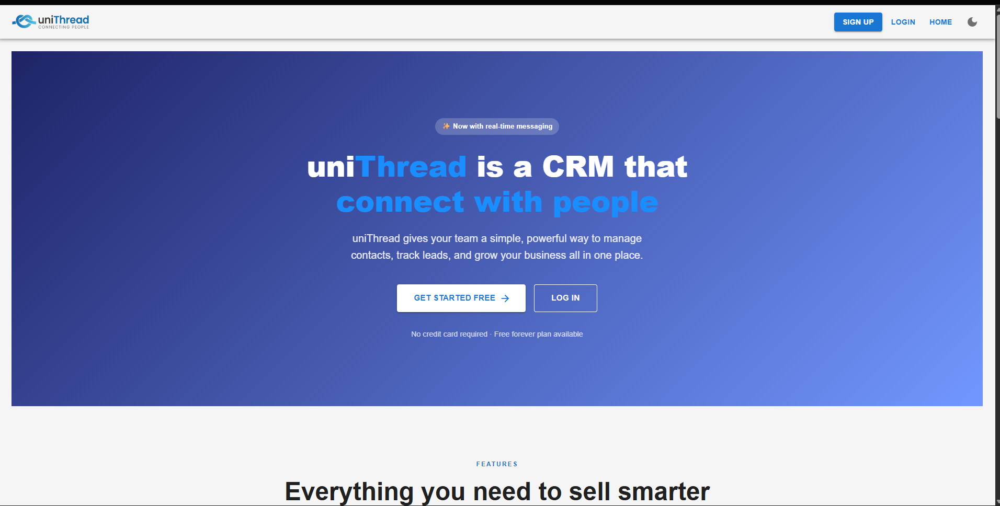
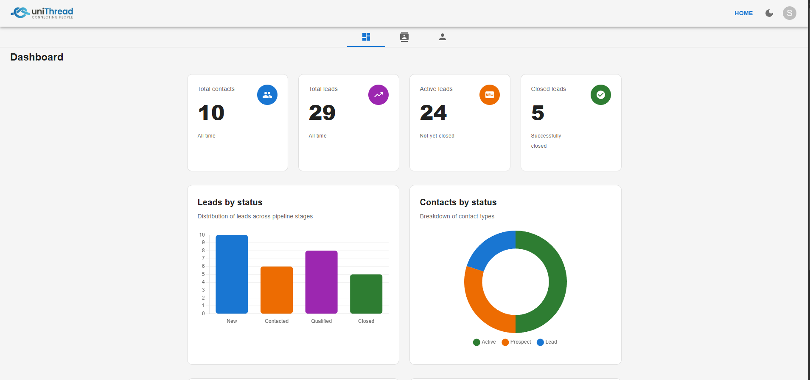
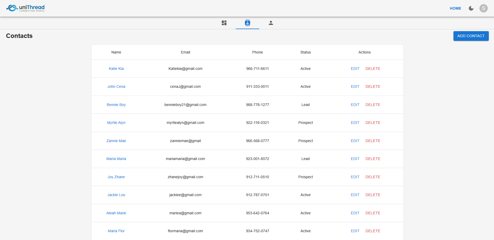
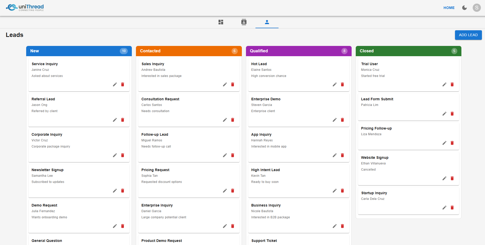

# uniThread

A full-stack CRM (Customer Relationship Management) application
built with React, TypeScript, Supabase, and Material UI. This is my
personal project to test my skills while learning other stack as well. 

## Preview
 



## Live  Demo
(https://unithreadcrms.netlify.app/)

## Features
- Contact management with full CRUD operations
- Lead pipeline with drag-and-drop Kanban board
- Real-time data powered by Supabase
- Authentication (email/password + OAuth)
- Interactive dashboard with Chart.js visualizations
- Dark mode support

## Tech Stack
Frontend: React, TypeScript, Vite, Material UI, Redux Toolkit
Backend: Supabase (PostgreSQL + Auth + Realtime)
Charts: Chart.js, react-chartjs-2
Drag & Drop: @hello-pangea/dnd
Deployment: Netlify

## Folder Structure

src/
├── components/          # Reusable UI components
│   ├── Header.tsx       # App header with dark mode toggle + user menu
│   ├── Topbar.tsx       # Navigation tabs
│   ├── Footer.tsx       # App footer
│   ├── StatCard.tsx     # Dashboard metric card
│   └── ProtectedRoute.tsx # Auth route guard
│
├── context/             # React Context providers
│   └── AuthContext.tsx  # Authentication context
│
├── hooks/               # Custom React hooks
│   ├── useAuth.ts       # Supabase auth session hook
│   └── useAuthContext.ts # Auth context consumer hook
│
├── layout/              # Page layout wrappers
│   ├── AppLayout.tsx    # Authenticated app layout
│   ├── PublicLayout.tsx # Public marketing layout
│   └── AuthLayout.tsx   # Auth pages layout
│
├── pages/
│   ├── public/          # Landing, Pricing, About
│   ├── auth/            # Login, Register, ForgotPassword
│   └── app/             # Dashboard, Contacts, Leads, Deals...
│
├── services/            # Supabase query functions
│   ├── supabase.ts      # Supabase client
│   ├── contactService.ts
│   ├── leadService.ts
│   └── dealService.ts
│
├── store/               # Redux state management
│   ├── store.ts         # Redux store configuration
│   ├── contactsSlice.ts # Contacts state + async thunks
│   ├── leadsSlice.ts    # Leads state + async thunks
│   ├── dealsSlice.ts    # Deals state + async thunks
│   └── uiSlice.ts       # UI state (theme mode)
│
├── types/               # TypeScript interfaces
│   ├── contact.ts
│   ├── lead.ts
│   └── deal.ts
│
├── theme.ts             # MUI theme configuration
└── App.tsx              # Root component + routing

##  Database Schema

```sql
-- Contacts
contacts (
  id uuid PK,
  name text,
  email text,
  phone text,
  status text,         -- 'active' | 'Prospect' | 'Lead'
  user_id uuid FK,
  created_at timestamptz
)

-- Leads
leads (
  id uuid PK,
  title text,
  name text,
  email text,
  phone text,
  status text,         -- 'New' | 'Contacted' | 'Qualified' | 'Closed'
  notes text,
  user_id uuid FK,
  created_at timestamptz
)

-- Deals
deals (
  id uuid PK,
  title text,
  value numeric,
  stage text,          -- 'Prospecting' | 'Proposal' | 'Negotiation' | 'Closed Won' | 'Closed Lost'
  contact_id uuid FK,
  contact_name text,
  notes text,
  close_date date,
  won boolean,
  user_id uuid FK,
  created_at timestamptz
)
```


---

## 🚀 Getting Started

### Prerequisites
- Node.js 18 or higher
- npm or yarn
- A free [Supabase](https://supabase.com) account

### 1. Clone the repository

```bash
git clone https://https://github.com/06Jest/crm-project
cd minicrm
```

### 2. Install dependencies

```bash
npm install
```

### 3. Set up Supabase

1. Create a new project at [supabase.com](https://supabase.com)
2. Go to SQL Editor and run the table creation scripts
   found in `/supabase/schema.sql`
3. Enable Email Auth in Authentication → Providers
4. Copy your project URL and anon key from Settings → API

### 4. Configure environment variables

Create a `.env` file in the project root:

```env
VITE_SUPABASE_URL=https://your-project.supabase.co
VITE_SUPABASE_ANON_KEY=your-anon-key-here
```

### 5. Run the development server

```bash
npm run dev
```

Open [http://localhost:5173](http://localhost:5173) in your browser.

---


## 🌐 Deployment

### Netlify (Primary)

1. Push your code to GitHub
2. Connect your repo to [Netlify](https://netlify.com)
3. Set build command: `npm run build`
4. Set publish directory: `dist`
5. Add environment variables in Netlify site settings
6. Add `public/_redirects` with: `/*    /index.html   200`

### Azure Static Web Apps (Secondary)

Coming soon — see roadmap.

---

## 🗺️ Roadmap

###  Milestone 1 — MVP (Complete)
- [x] Contact management with Supabase
- [x] Lead Kanban board with drag and drop
- [x] Contact detail pages
- [x] Deals pipeline with win/loss tracking
- [x] Live dashboard with Chart.js
- [x] Supabase Auth (email/password + OAuth)
- [x] Dark mode
- [x] Public landing page
- [x] Deployed to Netlify

###  Milestone 2 — Full CRM (In Progress)
- [ ] Activities / Communications page
- [ ] Customers / Accounts with Mapbox
- [ ] Customer leaderboard
- [ ] Real-time internal messaging (Supabase Realtime)
- [ ] Email via SMTP
- [ ] SMS via Twilio
- [ ] Stripe payment integration
- [ ] Reports page with CSV export
- [ ] Google Analytics dashboard
- [ ] Profile page with Cloudinary avatar upload
- [ ] Settings page with role management

###  Milestone 3 — SaaS (Planned)
- [ ] Multi-tenant workspace system
- [ ] Team invitation system
- [ ] Role-based access control (owner/admin/agent)
- [ ] Stripe subscription billing per workspace
- [ ] Azure deployment
- [ ] GitHub Actions CI/CD pipeline
- [ ] Jest unit tests


##  Contributing

This is a personal learning project but contributions and
suggestions are welcome!

1. Fork the repository
2. Create a feature branch: `git checkout -b feat/your-feature`
3. Commit your changes: `git commit -m 'feat: add your feature'`
4. Push to the branch: `git push origin feat/your-feature`
5. Open a Pull Request


##  Author

Jestony Silvano

- GitHub: [@06Jest](https://github.com/06Jest)
- LinkedIn: [linkedin.com/in/jestonyfrontenddev](https://www.linkedin.com/in/jestonyfrontenddev/)


## Acknowledgements

- [Supabase](https://supabase.com) — incredible open source Firebase alternative
- [Material UI](https://mui.com) — beautiful React component library
- [Redux Toolkit](https://redux-toolkit.js.org) — the official Redux toolset
- [Chart.js](https://chartjs.org) — simple yet flexible JavaScript charting
- [@hello-pangea/dnd](https://github.com/hello-pangea/dnd) — beautiful drag and drop for React


