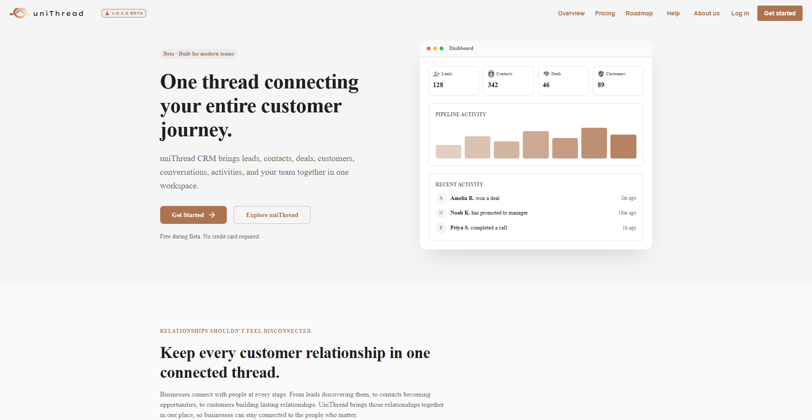
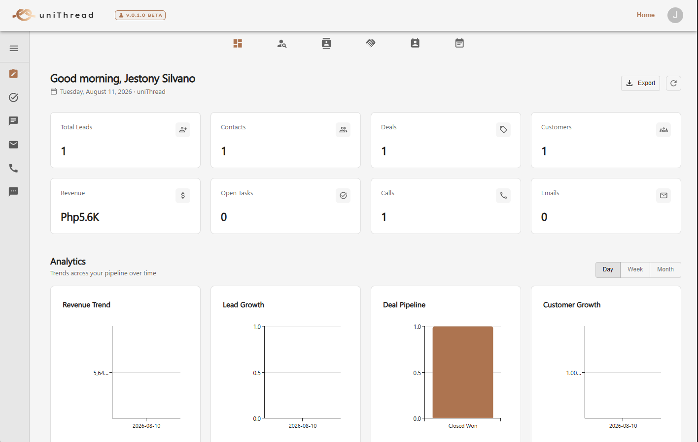
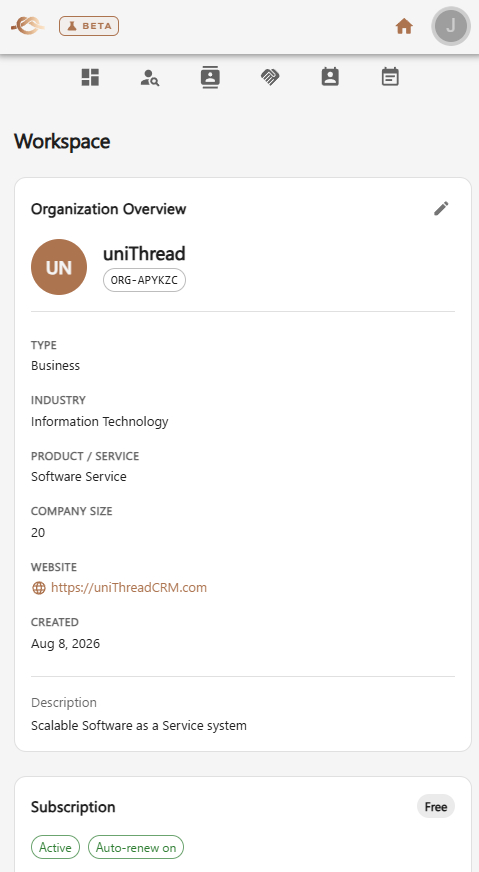
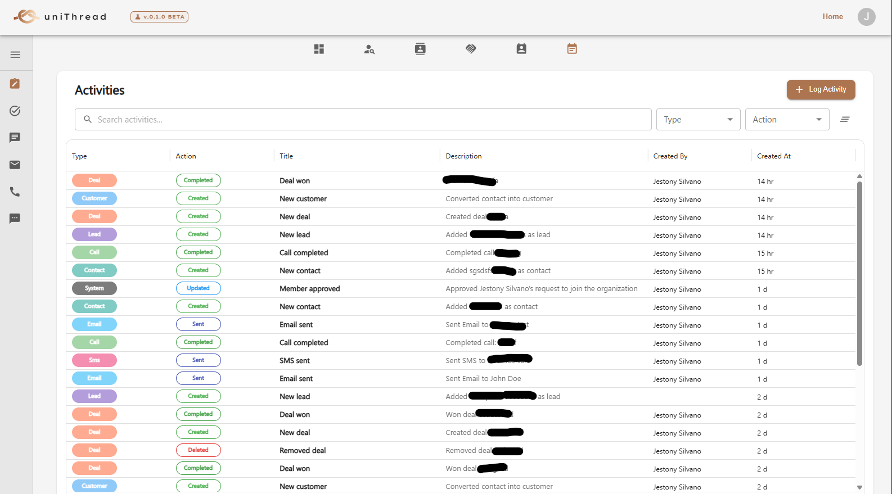
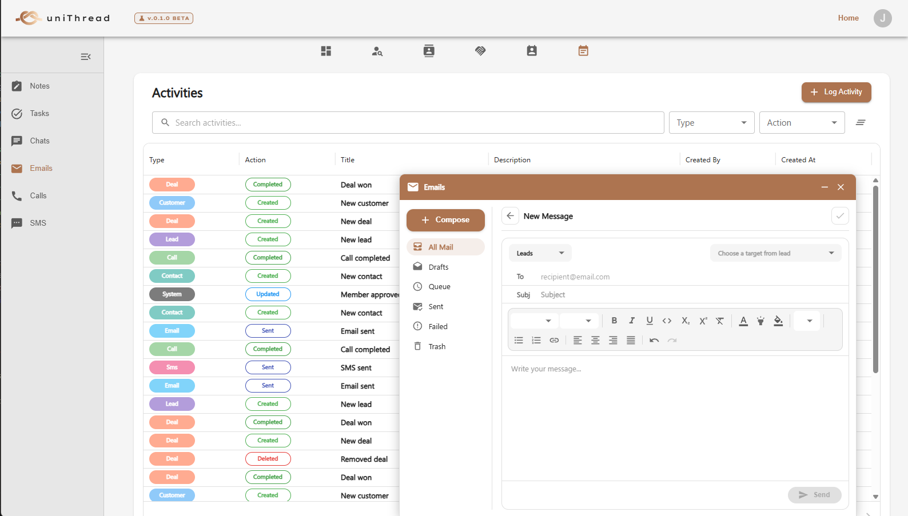

# uniThread CRM






> **One thread. One workspace. Connected relationships.**

uniThread is a multi-tenant SaaS Customer Relationship Management (CRM) platform designed to help businesses manage the relationships that matter to them, from the first lead, to an active contact, to a sales opportunity, and eventually to a customer.

The core idea behind **uniThread** is simple:

> **A lead, contact, or customer is a person, not just a record in a database.**

Businesses often manage customer information across spreadsheets, emails, messages, notes, calls, and disconnected tools. uniThread brings those relationships and the activities surrounding them together into one connected workspace.

Instead of treating every interaction as a separate thread, uniThread keeps the relationship connected throughout the customer lifecycle.

---

## Table of Contents

* [Overview](#overview)
* [Why uniThread](#why-unithread)
* [Core Concept](#core-concept)
* [Key Features](#key-features)
* [CRM Lifecycle](#crm-lifecycle)
* [Architecture](#architecture)
* [Technology Stack](#technology-stack)
* [Application Structure](#application-structure)
* [Multi-Tenancy](#multi-tenancy)
* [Authentication](#authentication)
* [Authorization & RBAC](#authorization--rbac)
* [Data Security](#data-security)
* [Communication Features](#communication-features)
* [Subscription System](#subscription-system)
* [Realtime Features](#realtime-features)
* [Validation](#validation)
* [Current Beta Status](#current-beta-status)
* [Feature Availability](#feature-availability)
* [Roadmap](#roadmap)
* [Getting Started](#getting-started)
* [Environment Variables](#environment-variables)
* [Development Workflow](#development-workflow)
* [Testing](#testing)
* [Deployment](#deployment)
* [Project Structure](#project-structure)
* [Database](#database)
* [API](#api)
* [Security Considerations](#security-considerations)
* [Known Limitations](#known-limitations)
* [Future Development](#future-development)
* [Project Philosophy](#project-philosophy)
* [Developer](#developer)
* [License](#license)

---

# Overview

uniThread CRM is a full-stack SaaS CRM built around the idea of maintaining a continuous relationship between a business and the people it serves.

The platform provides organizations with a centralized workspace for:

* Leads
* Contacts
* Deals
* Customers
* Tasks
* Notes
* Activities
* Email
* SMS workflows
* Call logging
* Internal team messaging
* Team management
* Role-based permissions
* Organization management
* Dashboards
* Subscription management
* Security controls

The application is designed as a **multi-tenant system**, meaning multiple organizations can use the same application while maintaining isolated data boundaries.

Each organization operates within its own workspace.

---

# Why uniThread?

Traditional CRM workflows can become fragmented.

A business may have:

```text
Spreadsheet
    ↓
Email
    ↓
Messaging application
    ↓
Notes
    ↓
Phone calls
    ↓
Sales pipeline
    ↓
Customer database
```

The information exists, but the relationship becomes fragmented.

uniThread approaches the problem differently:

```text
                    uniThread
                       │
                       ▼
                    Person
                       │
          ┌────────────┼────────────┐
          │            │            │
        Lead        Contact        Customer
          │            │
          └────── Deal ┘
                 │
                 ▼
        Activities & History
                 │
        ┌────────┼────────┐
        │        │        │
      Email     SMS      Calls
                 │
                 ▼
            Team Context
```

The goal is not simply to store information.

The goal is to **keep the relationship connected**.

---

# Core Concept

The name **uniThread** represents a single connected thread running through a customer relationship.

A relationship can begin as a lead:

```text
Lead
  ↓
Contact
  ↓
Deal
  ↓
Customer
```

Throughout that lifecycle, the organization can maintain:

* Conversations
* Emails
* Activities
* Notes
* Tasks
* Calls
* Sales information
* Assignment
* Relationship history

This allows teams to understand not only **who someone is**, but also **what happened with that relationship**.

---

# Key Features

## CRM

### Leads

Manage potential customers before they become active contacts.

Features include:

* Create leads
* Edit leads
* Delete leads
* Search
* Filtering
* Tags
* Notes
* Activities
* Assignment
* Lead qualification
* Lead conversion

Lead workflow:

```text
New
 ↓
Contacted
 ↓
Qualified
 ↓
Contact
```

Unqualified leads can remain available for historical reference and potential future follow-up.

---

## Contacts

Contacts represent people who have become active relationship records.

Contact information can include:

* Name
* Email
* Phone number
* Company
* Position
* Address
* Website
* Status
* Tags
* Notes
* Connected accounts

Contact actions include:

* Create
* Update
* Delete
* Search
* Filter
* Send email
* Simulated SMS
* Simulated calls
* Create deals
* Add notes
* Track activities

---

## Deals

Deals represent active sales opportunities.

A deal can track:

* Deal title
* Deal value
* Expected closing date
* Assigned member
* Pipeline stage
* Contact
* Notes
* Activities

The CRM provides a Kanban-style pipeline:

```text
Prospecting
    ↓
Proposal
    ↓
Negotiation
    ↓
Closed Won / Closed Lost
```

Deals can be moved between stages using drag-and-drop.

A successful deal can become a customer relationship.

---

## Customers

Customers represent successful relationships after a deal has been won.

Customer records can contain:

* Contact details
* Customer status
* Purchase history
* Activities
* Assigned member
* Notes

Customer statuses include:

```text
Active
Inactive
At Risk
Churned
```

Customer management focuses on maintaining the relationship after the sale.

---

# Tasks

Tasks help teams manage follow-up work.

Users can:

* Create tasks
* Assign tasks
* Set deadlines
* Create personal tasks
* Mark tasks public or private
* Complete tasks

Tasks provide a structured way to turn customer relationships into actionable work.

---

# Notes

Notes preserve context that should not disappear between conversations.

Notes can be associated with CRM records and can be:

* Personal
* Public
* Contextual to a relationship

Notes can be used to record:

* Customer context
* Sales strategies
* Follow-up information
* Important decisions
* Relationship history
* Deal information

---

# Activities

Activities provide a historical trail of important CRM actions.

Examples include:

* Lead created
* Contact updated
* Deal created
* Deal stage changed
* Customer created
* Email sent
* SMS recorded
* Call completed
* Member invited
* Member role changed
* Member removed

Activities help answer:

> Who did what, and when?

---

# Communications

uniThread provides communication workflows directly within the CRM.

## Email

Email functionality is currently available through the CRM.

Features include:

* Email composition
* Rich text editing
* Subject and body
* Sending from contact records
* Email history
* Activity tracking

The current implementation uses an outbound email provider integration.

---

## SMS

SMS is currently **simulated**.

The CRM provides the complete user workflow for composing and storing SMS messages without requiring a paid cellular messaging provider.

The current implementation does not send a real SMS to a phone.

Planned future integration:

* Real SMS provider
* Delivery status
* Failed message handling
* Provider webhooks

---

## Calls

Calls are currently **simulated**.

Users can:

* Log call outcomes
* Record call duration
* Add call notes
* Associate calls with CRM records

The current implementation does not perform real VoIP calls.

Future development may introduce a dedicated VoIP provider.

---

# Internal Team Chat

uniThread includes internal messaging for members of the same organization.

Features include:

* Direct team messaging
* Conversation history
* Realtime messaging
* CRM relationship context

Realtime functionality is currently focused on internal messaging.

Additional realtime capabilities are planned for future releases.

---

# Dashboard

The dashboard provides a high-level view of organization activity.

It can display:

* Total leads
* Total contacts
* Total deals
* Total customers
* Pipeline summaries
* Recent activity
* Business statistics
* Visual charts

The dashboard is intended as an overview rather than a replacement for detailed CRM records.

---

# Team Management

Organizations can manage their members from within the CRM.

Current roles:

```text
Owner
Manager
Agent
```

## Owner

The Owner has full control over the workspace.

Typical permissions include:

* Full workspace access
* Organization settings
* Subscription management
* Billing management
* Member management

---

## Manager

Managers are responsible for operating the team and CRM.

Typical capabilities include:

* Team management
* CRM management
* Member invitations
* Deal management
* Contact management

---

## Agent

Agents are focused on day-to-day CRM work.

Typical capabilities include:

* Managing assigned leads
* Managing assigned contacts
* Managing assigned deals
* Managing assigned customers
* Performing daily CRM operations

Actual permissions are enforced server-side.

---

# Multi-Tenancy

uniThread is designed as a **multi-tenant SaaS application**.

Multiple organizations can use the same application while maintaining isolated data.

Conceptually:

```text
                    uniThread
                        │
        ┌───────────────┼───────────────┐
        │               │               │
   Organization A  Organization B  Organization C
        │               │               │
     Members          Members          Members
        │               │               │
      Data             Data             Data
```

Organization A must never be able to access Organization B's data.

This applies to:

* Leads
* Contacts
* Deals
* Customers
* Activities
* Tasks
* Notes
* Messages
* Members
* Communications
* Organization information

---

# How Tenant Isolation Works

Tenant isolation is not implemented solely through the frontend.

The application uses multiple layers:

```text
Frontend
   ↓
Backend Authentication
   ↓
Backend Authorization
   ↓
Organization-scoped queries
   ↓
PostgreSQL Row Level Security
   ↓
Database
```

This means hiding a record in the UI is not considered sufficient security.

The backend validates organization access before processing protected operations.

PostgreSQL Row Level Security provides an additional database-level security boundary.

---

# Authentication

Authentication is handled server-side using JWT-based authentication.

The authentication flow is conceptually:

```text
User
 ↓
Login / Signup
 ↓
Authentication provider
 ↓
Profile lookup
 ↓
JWT generation
 ↓
Authenticated API requests
 ↓
Backend authorization
```

The authenticated token contains information required by the backend to identify the user and organization context.

The system supports:

* Email/password authentication
* Email verification
* Password reset
* Authenticated sessions
* JWT-based authentication

Google authentication is planned for future development.

---

# Authorization & RBAC

uniThread uses **Role-Based Access Control (RBAC)**.

Authorization is enforced on the backend.

The system does not rely solely on frontend checks such as:

```ts
if (user.role === 'owner') {
  showButton();
}
```

Instead, protected backend operations verify the user's permissions.

Conceptually:

```text
Request
   ↓
Authenticate user
   ↓
Identify organization
   ↓
Identify role
   ↓
Check permission
   ↓
Validate request
   ↓
Execute operation
```

If the user does not have permission, the backend rejects the operation.

This prevents users from bypassing permissions simply by manually constructing requests.

---

# Data Security

The application uses several security mechanisms.

## Authentication

* JWT authentication
* Authenticated sessions
* Email verification
* Password reset

## Authorization

* Role-based access control
* Backend authorization
* Protected API routes
* Organization-scoped operations

## Database

* PostgreSQL
* Row Level Security
* Organization-level data isolation

## Validation

* Request validation
* Structured data validation
* Backend validation before database operations

---

# Technology Stack

## Frontend

* React
* TypeScript
* Redux Toolkit
* React Router
* Material UI
* MUI DataGrid
* Chart.js
* Tiptap
* @hello-pangea/dnd

## Backend

* Node.js
* Express
* TypeScript
* JWT authentication
* Zod validation

## Database

* PostgreSQL
* Supabase
* PostgreSQL Row Level Security

## Communication

* Email provider integration
* Simulated SMS
* Simulated calls
* Realtime internal messaging

## Development

* Git
* GitHub
* GitHub Actions
* TypeScript
* ESLint / project linting tools where configured

---

# Architecture

uniThread follows a client-server architecture.

```text
┌───────────────────────────────────────┐
│              React App                │
│                                       │
│  Components                           │
│  Pages                                │
│  Redux Store                          │
│  Routing                              │
│  MUI                                  │
└───────────────────┬───────────────────┘
                    │
                    │ HTTP / JWT
                    ▼
┌───────────────────────────────────────┐
│          Node.js / Express API        │
│                                       │
│  Authentication                       │
│  Authorization                        │
│  Validation                            │
│  Business Logic                       │
│  Organization Scoping                 │
│  API Controllers                      │
└───────────────────┬───────────────────┘
                    │
                    ▼
┌───────────────────────────────────────┐
│             PostgreSQL                │
│                                       │
│  Organizations                        │
│  Profiles                             │
│  Leads                                │
│  Contacts                             │
│  Deals                                │
│  Customers                            │
│  Activities                           │
│  Messages                             │
│  Emails                               │
│  Subscriptions                        │
│  Refresh Tokens                       │
│                                       │
│  Row Level Security                   │
└───────────────────────────────────────┘
```

---

# Frontend Architecture

The frontend uses React with TypeScript.

Redux Toolkit is used for centralized application state.

The application separates concerns between:

* UI components
* Pages
* Redux slices
* API/service layers
* Authentication
* Application state
* Shared UI components
* Type definitions

Representative Redux domains include:

```text
Authentication
Conversations
Members
Messages
Leads
Contacts
Deals
Customers
```

The UI uses Material UI as its primary component system.

---

# Backend Architecture

The backend is built with:

* Node.js
* Express
* TypeScript

The backend is responsible for:

* Authentication
* Authorization
* Request validation
* Business rules
* Database access
* Organization isolation
* Protected API operations
* Token handling
* Communication workflows

The frontend does not directly control protected business operations.

---

# Database

The application uses PostgreSQL through Supabase.

Core entities include:

```text
organizations
profiles
leads
contacts
deals
customers
activities
refresh_tokens
emails
subscriptions
```

Additional communication and collaboration data is represented through the application's messaging and communication structures.

Relationships follow the CRM lifecycle:

```text
Organization
    │
    ├── Members
    │
    ├── Leads
    │      ↓
    │   Contacts
    │      ↓
    │    Deals
    │      ↓
    │   Customers
    │
    ├── Activities
    ├── Tasks
    ├── Notes
    └── Communications
```

---

# Data Lifecycle

A simplified relationship lifecycle is:

```text
Potential relationship
        │
        ▼
      Lead
        │
        │ Qualification
        ▼
     Contact
        │
        │ Opportunity
        ▼
      Deal
      /   \
     /     \
   Won     Lost
    │
    ▼
 Customer
```

The goal is to preserve context throughout the transition.

---

# Subscription System

uniThread has a subscription architecture designed for SaaS usage.

The system supports plan-based resource limits.

Resources can include:

* Members
* Leads
* Contacts
* Deals
* Customers
* Tasks
* Notes
* Emails
* SMS
* Calls

Subscription information can include:

* Plan
* Status
* Billing period
* Resource limits
* Retention
* Workspace access

The current Beta provides a **Free plan**.

Additional paid plans and payment-provider integrations are planned.

---

# Current Subscription Status

The application currently supports the foundation for subscription management, while payment provider integrations are not yet active.

Planned payment providers may include:

* Stripe
* PayPal
* GCash
* Maya

These should be considered planned integrations rather than currently active payment methods.

---

# Realtime

Realtime functionality is currently implemented primarily for internal messaging.

The messaging system supports:

* Realtime message updates
* Conversation state
* Message history
* Team communication

A polling fallback is also available where appropriate.

Broader realtime synchronization across CRM records is planned.

Future realtime functionality may include:

* Lead updates
* Contact updates
* Deal updates
* Customer updates
* Notifications
* Presence
* Typing indicators
* Unread counts

---

# Validation

The application uses structured validation to prevent invalid requests from reaching business logic and the database.

Validation is particularly important for:

* Authentication
* User input
* CRM records
* Organization operations
* Member management
* Communication requests
* Subscription operations

Zod is used within the backend validation layer.

---

# Current Beta Status

uniThread CRM is currently a **Beta release**.

The current Beta focuses on establishing the core CRM foundation and validating the overall product architecture.

### Available in Beta

* Multi-tenant organizations
* Authentication
* Email verification
* Password reset
* RBAC
* Owner / Manager / Agent roles
* Leads
* Contacts
* Deals
* Customers
* Tasks
* Notes
* Activities
* Dashboard
* Team management
* Internal chat
* Email
* Simulated SMS
* Simulated calls
* Subscription architecture
* Organization isolation
* PostgreSQL Row Level Security
* Responsive interface
* Help Center
* Feedback workflow

---

# Feature Availability

uniThread intentionally distinguishes between features that are live and features that are still being developed.

| Status          | Meaning                                                             |
| --------------- | ------------------------------------------------------------------- |
| **Live**        | Available and functional in the current Beta                        |
| **Simulated**   | UI/workflow exists but does not perform the real external operation |
| **Coming Soon** | Actively approaching implementation                                 |
| **Planned**     | Intended for a future release                                       |

Examples:

| Feature               | Status    |
| --------------------- | --------- |
| Leads                 | Live      |
| Contacts              | Live      |
| Deals                 | Live      |
| Customers             | Live      |
| Internal Chat         | Live      |
| Email                 | Live      |
| SMS                   | Simulated |
| Calls                 | Simulated |
| Google Authentication | Planned   |
| Real SMS              | Planned   |
| VoIP Calling          | Planned   |
| AI Assistant          | Planned   |
| Advanced Analytics    | Planned   |
| Broader Realtime      | Planned   |

This distinction is intentional so that users are not given the impression that simulated functionality is connected to a real external service.

---

# Roadmap

The roadmap is organized around several areas.

## Core Data

Planned improvements include:

* Company records
* Expanded address fields
* Record archiving
* Notifications
* Time zone support
* Multi-currency support
* International phone numbers
* Team leaderboard
* Advanced analytics
* Bulk data migration
* Calendar view
* Avatar uploads

---

## User Experience

Planned improvements include:

* Mute conversations
* Typing indicators
* Online presence
* Email templates
* Unread counts
* Guided tutorials
* Additional loading states
* Improved data placeholders
* Micro-interactions

---

## AI

Planned AI capabilities include:

* Contact insights
* Deal summaries
* Predictive scoring
* AI chat assistant
* Context-aware reply templates
* Retrieval-augmented answers

AI is intended to assist users with their CRM work rather than replace the relationship between businesses and people.

---

## Performance

Planned performance improvements include:

* Broader realtime synchronization
* Response caching
* Pagination
* Search optimization
* Large dataset optimization

---

## Administration

A future platform-level administration console is planned.

This will be separate from an organization's Owner role.

Conceptually:

```text
Platform
   │
   └── Super Admin
          │
          ├── Organization A
          ├── Organization B
          └── Organization C
```

An organization Owner operates inside one organization.

A platform Super Admin operates above individual organizations.

---

# Getting Started

## Prerequisites

Before running the project locally, install:

* Node.js
* npm
* Git
* A PostgreSQL/Supabase project

You will also need the required frontend and backend environment variables.

---

# Project Repositories

The project is separated into frontend and backend applications.

```text
06Jest/crm-project
    → uniThread frontend

06Jest/CRM-PROJECT-BACKEND
    → uniThread backend
```

---

# Clone the Project

Clone the frontend repository:

```bash
git clone <frontend-repository>
cd crm-project
```

Clone the backend repository separately:

```bash
git clone <backend-repository>
cd CRM-PROJECT-BACKEND
```

Replace the repository placeholders with the appropriate repository locations when publishing the project.

---

# Install Dependencies

For the frontend:

```bash
npm install
```

For the backend:

```bash
npm install
```

---

# Environment Variables

Create the required environment files for the frontend and backend.

Do not commit secrets to Git.

Typical configuration may include values such as:

```env
NODE_ENV=development
PORT=5000
```

Authentication configuration:

```env
JWT_SECRET=your_secret
SUPABASE_URL=your_supabase_url
SUPABASE_ANON_KEY=your_supabase_anon_key
```

Server-side Supabase configuration may also require the appropriate service credentials depending on how the backend is configured.

Email configuration may include the required provider API key and sender configuration.

> **Important:** The exact environment variable names should match the current implementation in the respective `.env.example` files or configuration modules.

Never commit:

* JWT secrets
* Supabase service keys
* Email provider API keys
* Database credentials
* OAuth secrets
* Production credentials

---

# Development

Start the backend:

```bash
npm run dev
```

Start the frontend:

```bash
npm run dev
```

The exact command may vary depending on the current package scripts.

---

# Production Build

Frontend:

```bash
npm run build
```

Backend:

```bash
npm run build
```

The production deployment should use production environment variables and production infrastructure.

---

# Development Workflow

A typical development workflow is:

```text
Create feature
    ↓
Implement frontend
    ↓
Implement backend
    ↓
Validate request
    ↓
Test authorization
    ↓
Test organization isolation
    ↓
Test database behavior
    ↓
Test responsive UI
    ↓
Build
    ↓
Review
    ↓
Commit
```

For security-sensitive changes, frontend behavior should never be treated as the final authorization boundary.

---

# Testing Checklist

Before releasing a significant change, verify:

## Authentication

* [ ] Sign up works
* [ ] Email verification works
* [ ] Login works
* [ ] Logout works
* [ ] Password reset works
* [ ] Invalid credentials are rejected
* [ ] Expired/invalid authentication is rejected

## Authorization

* [ ] Owner permissions work
* [ ] Manager permissions work
* [ ] Agent permissions work
* [ ] Unauthorized actions are rejected server-side

## Multi-Tenancy

* [ ] Organization A cannot access Organization B data
* [ ] Organization-scoped queries are correct
* [ ] RLS policies work
* [ ] Member access is restricted correctly
* [ ] Cross-tenant requests are rejected

## CRM

* [ ] Leads can be created
* [ ] Leads can be qualified
* [ ] Contacts can be created
* [ ] Deals can be created
* [ ] Deals can move through pipeline stages
* [ ] Customers can be created from successful relationships
* [ ] Activities are recorded correctly

## Communication

* [ ] Email workflow works
* [ ] Simulated SMS behaves correctly
* [ ] Simulated calls behave correctly
* [ ] Internal chat works
* [ ] Realtime messaging works

## UI

* [ ] Desktop layout works
* [ ] Tablet layout works
* [ ] Mobile layout works
* [ ] Navigation works
* [ ] Loading states are handled
* [ ] Error states are handled
* [ ] Empty states are handled

---

# Project Structure

The exact directory structure may evolve, but the project follows a separation between frontend and backend responsibilities.

A simplified structure:

```text
uniThread/
│
├── frontend/
│   │
│   ├── src/
│   │   ├── components/
│   │   ├── pages/
│   │   ├── features/
│   │   ├── services/
│   │   ├── store/
│   │   ├── hooks/
│   │   ├── types/
│   │   └── ...
│   │
│   ├── public/
│   ├── package.json
│   └── ...
│
├── backend/
│   │
│   ├── src/
│   │   ├── controllers/
│   │   ├── routes/
│   │   ├── middleware/
│   │   ├── services/
│   │   ├── schemas/
│   │   ├── types/
│   │   └── ...
│   │
│   ├── package.json
│   └── ...
│
└── README.md
```

---

# API

The backend exposes protected API endpoints used by the frontend.

API responsibilities include:

* Authentication
* Profiles
* Organizations
* Members
* Leads
* Contacts
* Deals
* Customers
* Activities
* Tasks
* Notes
* Messages
* Communications
* Subscriptions

Protected routes require authenticated requests.

The API validates:

1. Authentication
2. Organization context
3. User role
4. Request data
5. Resource ownership/access
6. Database operation

---

# API Design Principles

The backend follows several important principles.

### Authenticate before processing protected requests

```text
Request
 ↓
Authentication
```

### Authorize before performing protected operations

```text
Authentication
 ↓
Authorization
 ↓
Operation
```

### Validate before persistence

```text
Request
 ↓
Validation
 ↓
Business Logic
 ↓
Database
```

### Scope by organization

```text
User
 ↓
Organization
 ↓
Resource
```

This helps maintain predictable security boundaries in a multi-tenant environment.

---

# Security Considerations

uniThread is designed with security boundaries at multiple layers.

## Frontend

The frontend provides the user interface and improves the user experience.

However, frontend checks are not treated as security boundaries.

## Backend

The backend performs:

* Authentication
* Authorization
* Validation
* Organization scoping
* Business rule enforcement

## Database

PostgreSQL Row Level Security provides database-level restrictions.

This layered model reduces reliance on a single security mechanism.

---

# Important Security Principle

The application follows the principle:

> **Never trust the client.**

A user should not be able to gain access to protected data simply by:

* Modifying frontend state
* Changing a request payload
* Calling an API endpoint manually
* Changing an organization identifier
* Changing a role value on the client
* Bypassing a hidden UI element

Protected operations must be rejected by the backend/database when the user is not authorized.

---

# Known Limitations

uniThread is currently a Beta application.

Known limitations include:

### SMS

Real cellular SMS is not currently implemented.

### Calls

Real VoIP calling is not currently implemented.

### AI

AI functionality is planned and is not currently part of the core Beta workflow.

### Realtime

Realtime functionality currently focuses on internal messaging.

### Payments

Payment provider integrations are not currently active.

### Advanced Analytics

The dashboard provides foundational analytics, while deeper business intelligence is planned.

### Mobile

The interface is responsive, but additional responsive refinement remains part of Beta development.

### Large Datasets

Further optimization such as pagination, caching, and search improvements is planned for larger datasets.

---

# Product Philosophy

uniThread is built around a simple idea:

> **A CRM should help businesses connect with people, not simply communicate with a system.**

A lead is a person.

A contact is a person.

A customer is a person.

Behind every record is a relationship.

The CRM exists to help businesses understand, maintain, and strengthen those relationships.

The name **uniThread** represents that idea:

```text
One
 │
 ├── Person
 ├── Conversation
 ├── Activity
 ├── Deal
 ├── Task
 ├── Note
 └── Customer history
       │
       ▼
   One connected thread
```

---

# The Role of AI

uniThread is being developed during a period where businesses are increasingly adopting AI.

However, AI is not intended to become the relationship itself.

The long-term goal is for AI to assist businesses by:

* Finding useful information
* Summarizing relationships
* Highlighting important changes
* Helping prepare responses
* Providing insights
* Reducing repetitive work

The human relationship remains at the center.

AI should help people manage relationships better, not replace those relationships.

---

# Beta Philosophy

The Beta is intentionally transparent about what works and what does not.

uniThread distinguishes between:

```text
Live
Simulated
Coming Soon
Planned
```

This prevents experimental functionality from being presented as production-ready functionality.

The Beta is focused on validating:

* Product architecture
* Multi-tenancy
* Security
* CRM workflows
* RBAC
* User experience
* Responsive design
* Communication workflows
* Data relationships

---

# Future Development

The long-term direction of uniThread includes:

* Advanced analytics
* AI-assisted CRM
* Predictive scoring
* RAG-powered CRM knowledge
* Real SMS
* Real VoIP
* Expanded realtime synchronization
* Notifications
* Calendar integration
* Advanced reporting
* Bulk migration
* Company-level records
* Multi-currency
* International phone support
* Improved mobile experience
* Advanced subscription management
* Platform administration

The roadmap may change as real users provide feedback.

---

# Contributing

uniThread is currently primarily developed as an independent project.

For contributions, bug reports, or feature discussions, please use the project's available feedback and issue channels.

Before submitting a significant change, consider:

* Whether it affects tenant isolation
* Whether it affects authorization
* Whether it introduces a breaking API change
* Whether database migrations are required
* Whether frontend and backend behavior remain consistent
* Whether responsive layouts remain functional
* Whether the Help Center needs to be updated

---

# Documentation

The application includes an integrated Help Center covering:

* Getting Started
* Authentication
* Workspace management
* Team roles
* Leads
* Contacts
* Deals
* Customers
* Communications
* Activities
* Tasks
* Notes
* Dashboard
* Billing
* Security
* Troubleshooting
* FAQ
* Roadmap

Additional product documentation includes:

* Privacy Policy
* Terms of Service
* Security information
* Product overview
* API documentation

---

# Versioning

uniThread follows semantic versioning principles where applicable:

```text
MAJOR.MINOR.PATCH
```

Where:

* **MAJOR** - breaking changes
* **MINOR** - backward-compatible functionality
* **PATCH** - backward-compatible fixes

During Beta, APIs, database structures, and product functionality may evolve before the first stable release.

---

# Project Status

```text
Status: Beta
Stage: Active Development
Architecture: Full-stack SaaS
Deployment: Production-oriented
Multi-tenancy: Implemented
RBAC: Implemented
CRM Core: Implemented
Realtime Messaging: Implemented
Email: Implemented
SMS: Simulated
Calls: Simulated
AI: Planned
Payments: Planned
```

---

# Developer

**Jest**

Software Developer and creator of uniThread CRM.

uniThread was developed as a full-stack project to explore the engineering challenges involved in building a real SaaS product, including:

* Multi-tenant architecture
* Authentication
* Authorization
* RBAC
* PostgreSQL
* Row Level Security
* REST APIs
* React architecture
* State management
* Data modeling
* Realtime communication
* Responsive UI
* SaaS subscription architecture
* Security
* Product design
* Documentation

The project grew alongside the developer's journey from learning software development to designing and implementing a complete application architecture.

---

# Final Note

uniThread is more than a collection of CRUD interfaces.

The project was built around the idea that a CRM should preserve the **context of a relationship**.

A person may first appear as a lead.

They may become a contact.

A conversation may become a deal.

A successful deal may become a customer.

But throughout that journey, they remain the same human relationship.

**uniThread exists to keep that relationship connected.**

> **One thread. One workspace. Connected relationships.**

---

## License

This project is currently maintained as a private/independent software project.

License terms should be defined before distributing the source code publicly or accepting external contributions.
